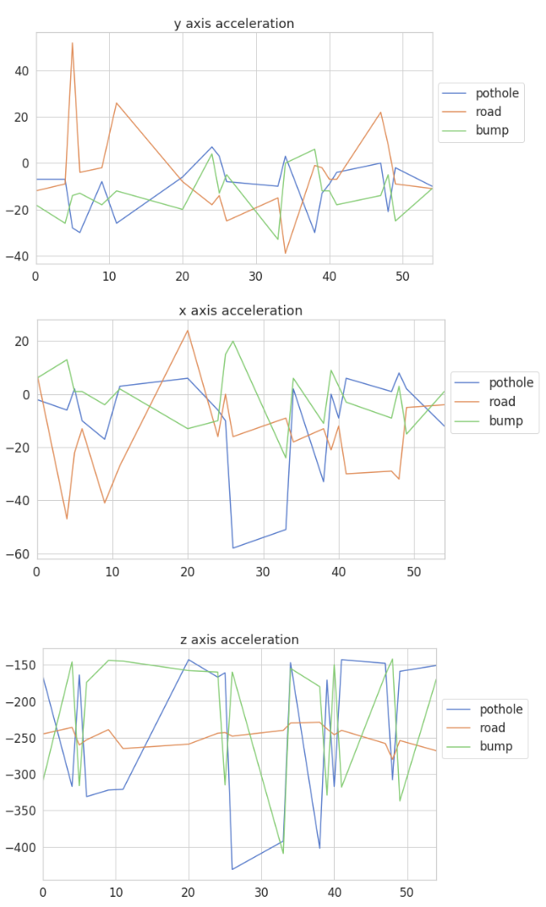
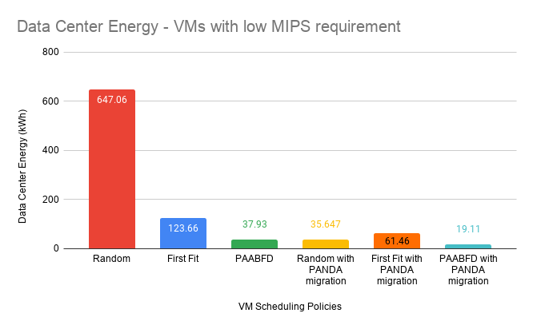
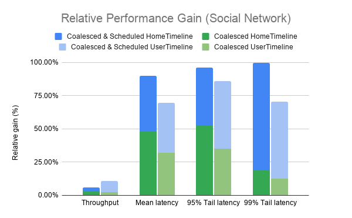
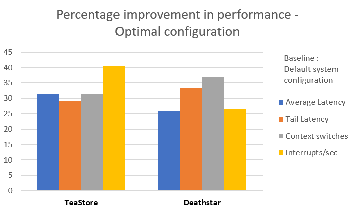
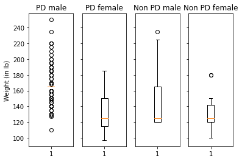
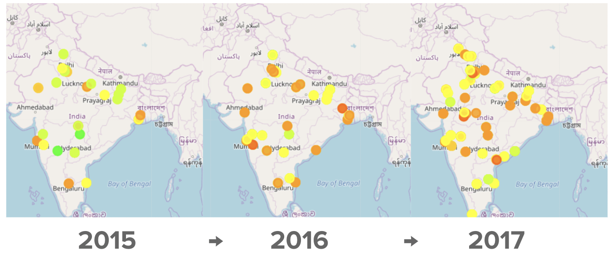

## Publications
- [A Deep Learning Approach for Speed Bump and Pothole Detection Using Sensor Data](https://link.springer.com/chapter/10.1007/978-981-16-1338-8_7) {: width="100" height="100"}
- [Energy efficient VM scheduling in Reservation supported Cloud Data Centers under availability constraints](https://ieeexplore.ieee.org/abstract/document/9498421) 
- [Scheduling Microservice Containers on Large Core Machines Through Placement and Coalescing](https://link.springer.com/chapter/10.1007/978-3-030-88224-2_5) 
- [Performance sensitivity of Operating System parameters in Microservice environments](https://ieeexplore.ieee.org/abstract/document/9499326) 
- [Characterization and detection of Parkinson’s Disease, A data driven approach](https://ieeexplore.ieee.org/abstract/document/9276892) 
- [Data Analysis of Air Pollutant Levels in India](https://ieeexplore.ieee.org/abstract/document/9298391) 
